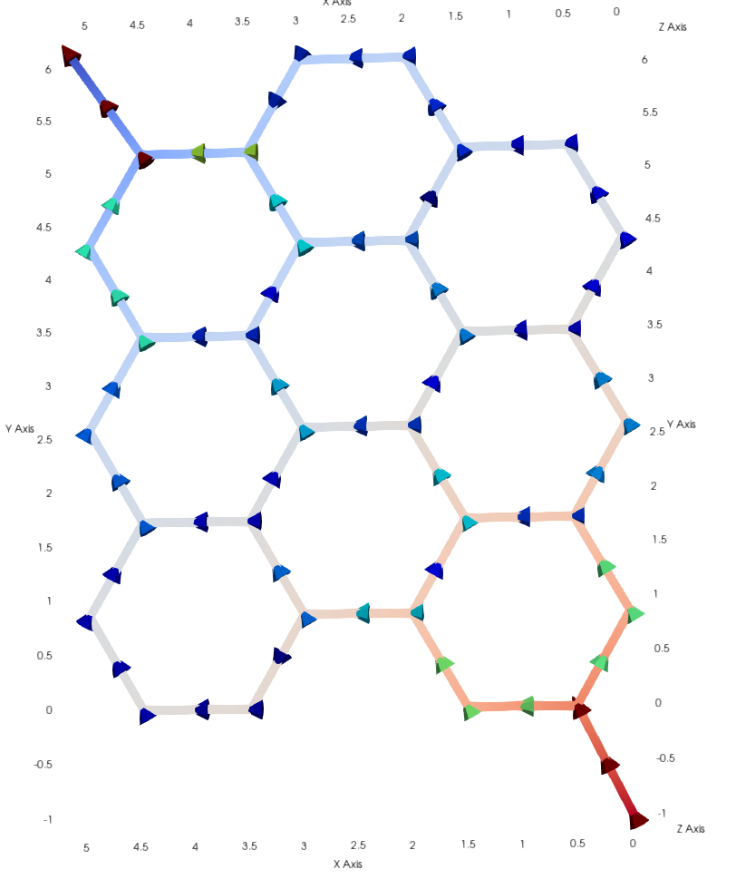

# Implementing network models in FEniCS

In this repo we experiment with using networkx to make graph meshes and solve equations on these in FEniCS.

## Installation
We use the mixed-dimensional branch of FEniCS combined with networkx. The environment is provided as a docker container. The container can be built and run locally by executing

```
git clone https://github.com/IngeborgGjerde/fenics-networks/
cd fenics-networks
docker build --no-cache -t fenics-networks .
docker run --name networkfenics -v $(pwd):/home/fenics/shared -d -p 127.0.0.1:8888:8888 networkfenics 'jupyter-notebook --ip=0.0.0.0'
```

You can then enter the container by running 
```
docker exec -it networkfenics /bin/bash
```
To connect it to a jupyter notebook, run
```
docker logs networkfenics
```
and enter the html-links it provides in your browser.

[]([https://www.google.com/](https://github.com/IngeborgGjerde/fenics-networks/honeycomb.png?raw=true))
