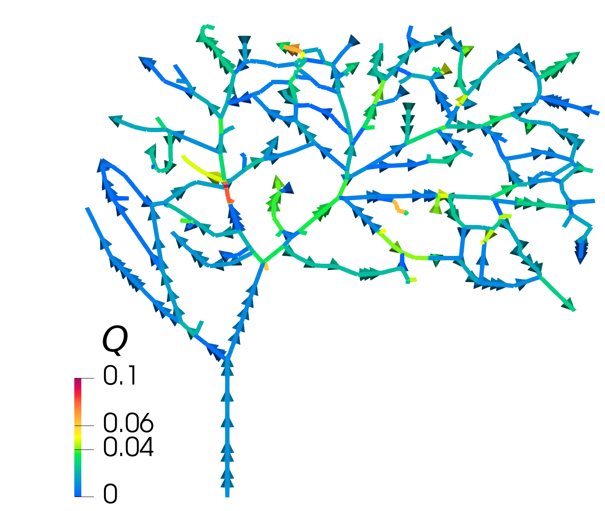

# Summary
Network models facilitate inexpensive simulations, but require careful
handling of bifurcation conditions. In this software we combine
`networkx` (Hagberg et.al. 2008) and `FEniCS`
(Logg et.al. 2012) into the `graphnics` library, which
offers
-   A `FenicsGraph` class built on top of the `DiGraph` class in `networkx`, that constructs a global mesh for a network and provides `FEniCS` mesh functions describing how they relate to the graph structure.
-   Example models showing how the `FenicsGraph` class can be used to
    assemble and solve different network flow models.
The example models are implemented using `fenics_ii` (Kuchta 2019) as this allows for assembling also coupled 1D-3D flow models. The code used for the assembly of the system can be  directly translated to use different flavours of `FEniCS`, using e.g. the mixed-dimensional branch of `FEniCS` (Daversin-Catty et.al. 2021) or `multiphenics`.

# Statement of need
`FEniCS` (Logg et.al. 2012) provides high-level
functionality for specifying variational forms. This allows the user to
focus on the model they are solving rather than implementational
details. A key component of network models is the correct handling of
bifurcation conditions. A natural bifurcation condition is the conservation of mass at junctions, meaning that there should be no jump in the cross-section flux.
`FEniCS` implicitly assumes that each vertex is connected to
two cells. At bifurcation vertices in a network, however, the vertex is
connected to three or more cells. Thus one cannot use the jump operator
currently offered in `FEniCS`. The manual assembly of the
jump terms is highly prone to errors once the network becomes
non-trivial.

In this software we extend the `DiGraph` class offered by
`networkx` so that it (i) creates a global mesh of the
network and (ii) creates data structures describing how this mesh is
connected to the graph structure of the problem. In addition to this we
provide convenience functions that then it make it straightforward to
assemble and solve network flow models using the finite element method.

# Mathematics

Let $\mathsf{G}=(\mathsf{V}, \mathsf{E})$ denote a graph $\mathsf{G}$
with edges $\mathsf{E}$ and vertices $\mathsf{V}$. We let $\Lambda_i$ be
the geometrical domain associated with the edge $e_i$.

We want to solve flow models on networks, the simplest example being the
hydraulic network model 

$$\begin{aligned}
    \mathcal{R} Q_i + \partial_s P_i &= 0 \text{ on } \Lambda_i && \text{(constitutive equation on edge)} \\ 
    \partial_s Q_i &= f \text{ on } \Lambda_i  && \text{(conservation of mass on edge)}\\ 
    [[Q]]_b &= 0 \text{ for } b \in \mathsf{B}  && \text{(conservation of mass at bifurcation)}
\end{aligned}$$

where $Q_i$ denotes the cross-section flux along an edge, $P_i$ denotes
the pressure on an edge, $\mathcal{R}$ denotes the flow resistance and
$\partial_s$ denotes the spatial derivative along the (one-dimensional)
edge. Further 

$$\begin{aligned}
[Q]_b =  \sum_{i \in \mathsf{E}_{in}(b)} Q_i(b) - \sum_{i \in \mathsf{E}_{out}(b)} Q_i(b)
\end{aligned}$$

is used to denote the jump in cross-section flux over a bifurcation. To
close the system we further assume the pressure is continuous over each
bifurcation point.

The variational form associated with this model reads: Find $Q \in V$
and $(P, \lambda) \in M$ such that

$$\begin{aligned}
    a(Q,\psi)+b(\psi,(P, \lambda)) &= 0 \\
    b((\phi, \xi), Q) &= (f, \phi)
\end{aligned}$$ 

for all $\psi \in V$ and $(\phi, \xi) \in M$, where 

$$\begin{aligned}
    a(Q, \psi) &= \sum_{i=1}^n (\mathcal{R} Q, \Psi)_{\Lambda_i}. \\
    b(\psi, (P, \lambda)) &= -(\partial_s \psi, P) + \sum_{b \in \mathsf{B}} [\Psi]_b \lambda_b.
\end{aligned}$$

Here
$\lambda=(\lambda_1, \lambda_2, \lambda_3, ..., \lambda_m) \in \mathbf{R}^{\vert \mathsf{B} \vert}$
is a Lagrange multiplier used to impose conservation of mass at each bifurcation point.

# Software

## The `FenicsGraph` class

The main component of `graphnics` is the `FenicsGraph`
class, which inherits from the `DiGraph` class in `networkx`.
The `FenicsGraph` class provides a function for meshing the network;
meshfunctions are used to relate the graph structure to the cells and
vertices in the mesh. Tangent vectors $\boldsymbol{\tau}_i$ are computed
for each edge and stored as edge attributes for the network. This is
then used in a convenience class function **dds$\_$i** which returns the
spatial derivative $\partial_s f_i = \nabla f_i \cdot \boldsymbol{\tau}_i$ on the edge.

## Network models

`graphnics` can further be used to create and solve network flow models.
If the problem is posed in terms of global variables this can be done using standard methods in `FEniCS`; this is demoed in the `NetworkPoisson` model. For
problems that are posed in terms of edge and vertex variables, the graph iterators in `networkx` can be used to add their contributions to the block matrix. This is demoed in the `MixedHydraulicNetwork` and `NetworkStokes` model classes.

<figcaption> Figure 1: Simulation of fluid flow in the pial blood vessel network of a rodent (Blinder et. al. 2010). The network consists of 417 edges and 389 vertices, of which 320 are bifurcation points. The pressure (a) and cross-section flux (b) were computed using the hydraulic network model.
 </figcaption>

# Acknowledgments

We thank Miroslav Kuchta, Cecile Daversin-Catty and Jørgen Dokken for
their input on the implementation, and Pablo Blinder and David Kleinfeld
for sharing data for the pial vasculature of rodents.

This research is supported by the European Research Council (ERC) under the European Union’s Horizon 2020 research and innovation programme under grant agreement 714892 (Waterscales)

# References

Aric Hagberg and Pieter Swart and Daniel S. Chult. (2008). *Exploring network structure, dynamics, and function using NetworkX*. 

Anders Logg, Kent-Andre Mardal and Garth Wells. (2012). *Automated solution of differential equations by the finite element method: The FEniCS book*. Springer Science & Business Media, 84. 

Miroslav Kuchta (2019). *Assembly of multiscale linear PDE operators*. Numerical Mathematics and Advanced Applications ENUMATH, p. 641-650.

Cecile Daversin-Catty, Chris N. Richardson, Ada Johanne Ellingsrud and Marie E. Rognes. (2021). *Abstractions and automated algorithms for mixed-dimensional finite element methods*. ACM Transactions on Mathematical Software (TOMS)

Pablo Blinder, Andy Y. Shih, Christopher Rafie and David Kleinfeld (2010). *Topological basis for the robust distribution of blood to rodent neocortex*. Proceedings of the National Academy of Sciences 107(28) p. 12670-12675

